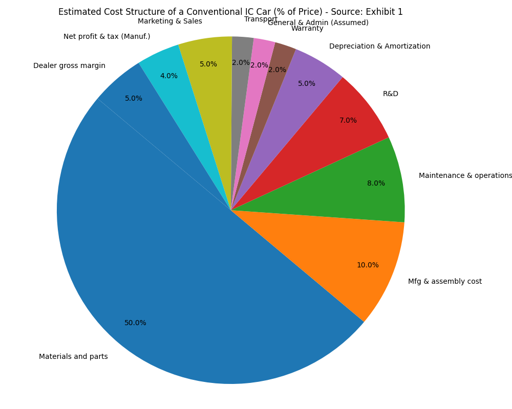

# Tesla Motors: Navigating the Future of Electric Mobility (Early 2013)

## 1. Introduction

In early 2013, Tesla Motors stood at a pivotal juncture, a burgeoning entity in the century-old automotive industry, yet already demonstrating disruptive potential. The company, under the visionary leadership of Elon Musk, had just announced its first profitable quarter, a significant milestone that sent ripples through both Silicon Valley and Detroit (Source: Page 1). With the successful launch and production ramp-up of its Model S sedan, which garnered critical acclaim including the Motor Trend Car of the Year award and the highest-ever rating from Consumer Reports, Tesla was more than just an electric vehicle (EV) manufacturer; it was a symbol of innovation and a potential harbinger of a paradigm shift in personal transportation (Source: Page 1). The Model S was not only outselling other electric cars in the U.S. but was also making inroads against established luxury internal combustion engine (ICE) vehicles like the BMW 7 Series and Audi A8 in terms of sales volume (Source: Page 1).

Founded in 2003, Tesla's mission extended beyond creating high-performance electric sports cars like its initial offering, the Roadster. Musk envisioned Tesla as a catalyst for sustainable transport, aiming to produce a full range of electric vehicles, eventually including affordable mass-market options (Source: Page 9, "The Secret Tesla Motors Master Plan"). The company's early success, marked by technological prowess and a rapidly appreciating stock price, was undeniable. However, this success also brought forth pressing questions. Was Tesla's profitability sustainable, or a fleeting moment fueled by initial enthusiasm and ZEV credit sales? Could a company that had never mass-produced cars scale its operations to meet the ambitious targets for the Model S and the upcoming Model X SUV, let alone a future high-volume, lower-priced "Gen 3" vehicle? The central question looming over Tesla was whether it could transition from a niche, albeit highly influential, player into a mainstream, high-volume automaker capable of fundamentally altering the automotive landscape. Its journey was fraught with immense challenges, from technological hurdles to entrenched competition, but its achievements so far suggested that underestimating Tesla would be a mistake.

## 2. Tesla's Competitive Landscape & Strengths

Tesla entered an automotive world dominated by giants with decades, if not centuries, of experience, vast manufacturing capabilities, and extensive dealership networks. Competitors like General Motors, Ford, Toyota, BMW, and Audi possessed enormous resources and brand recognition (Source: Page 3). Simultaneously, the EV space was seeing new entrants and efforts from established players. Nissan, with its Leaf, was an early mass-market EV contender, though its sales had not met initial lofty projections (Source: Page 6). Other startups, like Fisker Automotive, had stumbled, highlighting the immense difficulty of succeeding in this capital-intensive industry (Source: Page 6, `output/evidence.csv` - "Fisker hires bankruptcy team...").

Despite this formidable landscape, Tesla had carved out a unique position underpinned by several key strengths:

**Technological Leadership:** Tesla's core strength lay in its proprietary EV technology, particularly its battery systems and powertrain. Unlike competitors who were developing specialized EV batteries from scratch or outsourcing, Tesla innovatively used thousands of commodity 18650 lithium-ion cells, typically found in laptops, for its battery packs (Source: Page 7). This approach, coupled with sophisticated battery management systems and liquid cooling, allowed Tesla to achieve superior range, performance, and potentially lower costs. The case notes that Tesla's 60kWh battery pack was estimated at $250-$300 per kWh, less than half the estimated cost per kWh for the Nissan Leaf (Source: Page 7). Furthermore, its electric motors and powertrain were designed in-house, leading to impressive performance metrics for the Model S (0-60 mph in under 6 seconds). The integration of a 17-inch touchscreen as the primary control interface and over-the-air software updates showcased a Silicon Valley approach to automotive design, setting it apart from traditional manufacturers (Source: Page 7-8, `output/annotated.json` - "Technology": "The car also had a 17\" touchscreen...").

**Brand Appeal and Perception:** Tesla cultivated a powerful brand image associated with innovation, luxury, high performance, and environmental responsibility. The Model S was not just an electric car; it was a status symbol, a "jaw-dropper" that changed perceptions of what EVs could be (Source: Page 7). This strong brand, amplified by Elon Musk's public persona, created intense customer loyalty and high demand, often with customers willing to wait months for their vehicles.

**Visionary Leadership:** Elon Musk's role was central to Tesla's identity and strategy. His clear vision for transitioning the world to sustainable energy, coupled with his engineering acumen and relentless drive, attracted talent and investment. His personal financial backing and guarantees, such as the resale value guarantee for the Model S pegged to similar BMW and Mercedes models, further underscored his commitment (Source: Page 5).

**Vertical Integration and Business Model Innovation:** Tesla pursued a high degree of vertical integration. It designed its cars and much of their core technology in-house, manufactured them in its Fremont plant (the former NUMMI facility acquired at a favorable price), and sold them directly to consumers through company-owned stores rather than traditional franchise dealerships (Source: Page 8). This direct sales model, while controversial and legally challenged in some states, allowed Tesla to control the customer experience, educate buyers about EVs, and capture more retail margin. The development of its own "Supercharger" network of fast-charging stations was another strategic move to address range anxiety and enhance the ownership experience, a significant differentiator (Source: Page 5).

**Product Excellence:** The Model S itself was a testament to Tesla's capabilities. It offered superior range compared to most contemporary EVs (up to 250 miles), exhilarating performance, a revolutionary interior design, and top safety ratings (Source: Page 7, Exhibit 9). The car's design, with the battery pack forming the floor, provided excellent handling and structural rigidity (Source: Page 4). These attributes allowed Tesla to compete not just with other EVs but also with high-end gasoline-powered luxury sedans.

These strengths collectively gave Tesla a significant first-mover advantage in the premium EV segment and laid a foundation for its ambitious future plans, though the path ahead was far from clear of obstacles.

## 3. Challenges and Risks

Despite its early triumphs and distinct advantages, Tesla faced a multitude of significant challenges and risks that threatened its long-term viability and ambitious expansion plans. These hurdles spanned manufacturing, market acceptance, competition, regulation, and internal dependencies.

**Manufacturing Scalability and Cost Control:** One of the most critical challenges was scaling production from the relatively low volumes of the Roadster (2,500 units total) and the initial Model S ramp-up (target of 21,000 for the first full year) to true mass-market levels required for the envisioned "Gen 3" vehicle (Source: Page 1, Page 9). Car manufacturing is notoriously complex and capital-intensive, with high minimum efficient scales for traditional assembly plants (Source: Page 2). While Tesla acquired the NUMMI plant with significant capacity, efficiently producing hundreds of thousands of vehicles per year at a competitive cost, especially for a $35,000 car, was an unproven capability for the company (Source: Page 8, `output/annotated.json` - "Risks": "Analysts worried that this might put Tesla at a cost disadvantage."). The learning curve in automotive manufacturing is steep, and any missteps could lead to costly delays, quality issues, and an inability to meet demand or achieve target price points.

**Range Anxiety and Charging Infrastructure:** "Range anxiety"—the fear of running out of power before reaching a destination or charging station—remained a primary concern for potential EV buyers (Source: Page 5, `output/evidence.csv` - "The second were different sources of 'range anxiety'..."). While the Model S offered a commendable range, the broader public perception and the practical limitations of charging time and station availability (especially outside California) were significant adoption barriers. Tesla's strategy of building out its own Supercharger network was a direct response but required substantial ongoing investment and rapid expansion to be truly effective nationwide and globally (Source: Page 5).

**Intensifying Competition:** The automotive industry is fiercely competitive. While Tesla had a lead in EV technology and performance, established automakers like GM, Ford, BMW, Nissan, and Toyota were increasing their investments in EV and hybrid technologies (Source: Page 6, `output/annotated.json` - "Competition"). These companies possessed vast financial resources, manufacturing expertise, global supply chains, and extensive dealer and service networks. As they introduced more EV models, potentially with lower price points or leveraging existing brand loyalty, Tesla would face much stiffer competition. The case mentions GM lowering the price of its Volt in response to Nissan's Leaf price cut, indicating price sensitivity and competitive reactions (Source: Page 6).

**Regulatory and Political Hurdles:** Tesla's direct-to-consumer sales model, bypassing traditional independent dealerships, was a source of significant conflict. The dealership lobby actively campaigned to pass laws in various states to prevent Tesla from selling directly, posing a major threat to its sales and distribution strategy (Source: Page 8, `output/evidence.csv` - "This approach put Tesla in conflict with the dealership lobby..."). Navigating these legal and political battles required considerable effort and resources and could limit market access. Furthermore, Tesla's profitability in early 2013 was also aided by the sale of Zero-Emission Vehicle (ZEV) credits, an income stream that was expected to diminish as other manufacturers increased their EV sales (Source: Page 5, Exhibit 12).

**Reliance on Elon Musk:** Elon Musk's vision, charisma, and technical expertise were undeniably critical to Tesla's success. However, this heavy reliance on a single individual also represented a key person risk. His involvement in other ambitious ventures (SpaceX, SolarCity) also raised questions about his divided attention (Source: Page 6). Any event affecting Musk's ability to lead Tesla could have profound negative consequences for the company.

**Financial Sustainability:** While achieving its first profitable quarter was a landmark, questions remained about long-term financial sustainability. Tesla was still investing heavily in R&D, expanding its manufacturing capabilities, and building out its Supercharger network and retail stores (Source: Exhibit 12). These activities consumed significant capital. Ensuring consistent profitability while funding this aggressive growth, especially as it moved towards lower-margin mass-market vehicles, was a critical financial challenge. The company's access to capital markets and its ability to manage cash flow effectively would be paramount.

## 4. Financial & Operational Analysis

Tesla's financial picture in early 2013 was one of rapid growth and emerging, albeit nascent, profitability. The announcement of a net income exceeding $10 million on $560 million in sales for Q1 2013 was a significant turning point, signaling a potential shift from a cash-burning startup to a self-sustaining business (Source: Page 1). For the first half of 2013, revenues reached $966.9 million, a substantial increase from previous years, driven primarily by Model S sales (Source: Exhibit 12). Gross profit stood at $196.8 million for H1 2013.

However, operating expenses remained high, with R&D at $107.1 million and SG&A at $107.0 million for H1 2013 (Source: Exhibit 12). This reflected Tesla's continued investment in future technologies (like the Model X and Gen 3), expansion of its production facilities, and the build-out of its unique sales and service infrastructure. A notable component of Tesla's revenue and profitability during this period was the sale of ZEV credits, which amounted to $119.4 million in H1 2013 (Source: Exhibit 12). This revenue stream, while beneficial, was understood to be temporary as other manufacturers increased their own EV production. Tesla's ability to maintain profitability as these credits waned would be a key test. The company's balance sheet showed growing assets, including a significant investment in property, plant, and equipment, largely related to the Fremont factory (Source: Exhibit 13).

Operationally, Tesla was unique. Its decision to purchase the NUMMI plant from Toyota for $42 million, a fraction of its original worth, and acquire production equipment at discounted prices, was a shrewd move to establish a large-scale manufacturing footprint relatively cheaply (Source: Page 8). Tesla aimed for a high degree of in-house production for Model S-specific parts, including its powertrain and a significant portion of its plastic components, which was unusual for a low-volume plant but provided greater control over technology and supply (Source: Page 8).

The traditional cost structure of an internal combustion (IC) car, as detailed in Exhibit 1, provides a useful contrast. For a typical $25,000 IC car, materials and parts accounted for 50% of the price, with manufacturing and assembly adding another 10% (Source: Exhibit 1). Tesla's challenge was to manage its EV-specific costs, particularly the expensive battery pack (estimated at $15,000-$18,000 for the 60kWh Model S pack, though significantly cheaper per kWh than competitors like the Leaf - Source: Page 7), and bring them down to a level that would allow for profitable mass-market vehicles.

Tesla's sales and service model was another radical departure from industry norms. By owning its stores and service centers, Tesla aimed to control the customer experience and better explain the benefits of EVs (Source: Page 8). Salespeople were salaried, not commission-based, to align incentives with customer education. While this provided a superior brand experience, it also meant Tesla bore the full cost of establishing and maintaining this infrastructure, unlike traditional automakers who relied on franchised dealers. The "Tesla Rangers" mobile service and valet options were innovative but added to operational complexity and cost (Source: Page 8). The success of this operational model, particularly its scalability and cost-effectiveness, was yet to be fully proven.

## 5. Future Outlook & Strategic Imperatives

Tesla's future in early 2013 was incredibly promising yet laden with substantial risks. Elon Musk's "Secret Master Plan" was clear: use the profits from high-end cars (Roadster, Model S) to develop and build increasingly affordable mass-market electric vehicles, ultimately accelerating the transition to sustainable transportation (Source: Page 9). The next major step in this plan was the "Gen 3" vehicle, envisioned to be a BMW 3 Series competitor priced around $35,000 (Source: Page 9). The viability of this Gen 3 car and Tesla's ability to execute this phase of its strategy were the central questions defining its long-term outlook.

Achieving the Gen 3 vision required Tesla to successfully navigate several critical strategic imperatives:

**1. Continued Battery Cost Reduction and Innovation:** The battery remained the single most expensive component of an EV. For the Gen 3 to be profitable at a $35,000 price point, Tesla needed to achieve further significant reductions in battery pack costs per kWh. This meant relentless R&D in battery chemistry, cell design, pack manufacturing, and scaling relationships with suppliers like Panasonic (Source: Page 7). The case notes an 85-90% experience curve for Li-Ion batteries, suggesting costs would fall with increased production volume, but proactive innovation was also essential (Source: Page 4, `output/annotated.json` - "Technology": "The experience curve for Li-Ion batteries was estimated to be between 85 and 90%.").

**2. Mastering Mass Manufacturing and Supply Chain Management:** Producing hundreds of thousands of Gen 3 vehicles annually demanded a leap in manufacturing expertise and efficiency far beyond what Tesla had demonstrated with the Model S. This involved streamlining assembly processes, ensuring high quality control, managing a vastly more complex supply chain, and optimizing the Fremont plant's output (Source: Page 8). Any significant delays or quality issues in the Gen 3 launch could be detrimental.

**3. Rapid Expansion of Supercharger and Service Infrastructure:** A mass-market Tesla would necessitate a much denser and more widespread Supercharger network to alleviate range anxiety for a broader customer base (Source: Page 5). Similarly, the service infrastructure (service centers, mobile rangers) would need to scale significantly to handle a larger fleet of vehicles, maintaining customer satisfaction without incurring excessive costs.

**4. Sustained Marketing and Brand Differentiation:** As established automakers entered the EV market more aggressively, Tesla would need to continue differentiating its brand and products. Relying solely on Musk's persona or word-of-mouth would be insufficient. Sustained marketing efforts emphasizing Tesla's technological superiority, unique features, and ownership experience would be crucial to attract mainstream buyers. (Source: `output/evidence.csv` - "Its Model S had sold more than the BMW 7 and Audi A8 combined.")

**5. Navigating Regulatory and Competitive Landscapes:** Tesla had to continue fighting legal battles to defend its direct sales model or find alternative solutions for states where it was prohibited (Source: Page 8). As competition intensified, Tesla needed to maintain its innovation pace to stay ahead, not just in EV technology but also in software, autonomous driving features (though not a focus in 2013, it was on the horizon), and overall user experience.

**6. Financial Prudence and Securing Funding:** The development of the Gen 3 and the associated scaling of operations would require enormous capital investment. Tesla needed to manage its cash flow carefully, achieve sustained profitability with the Model S and X, and likely raise additional capital from equity or debt markets. Investor confidence, buoyed by meeting production targets and financial goals, would be critical (Source: `output/evidence.csv` - "Over the next three months, its stock price almost tripled.").

Successfully executing these imperatives was a monumental task. The Gen 3 was not just another car model; it was the litmus test for Tesla's entire long-term strategy and its ambition to become a dominant force in the automotive industry. While the risks were undeniable, Tesla's track record of innovation, its strong brand, and Musk's unwavering determination suggested that it had a fighting chance to redefine the future of mobility. The journey from a niche luxury EV maker to a mass-market automotive giant was the ultimate challenge that lay ahead.

Readability - Gunning Fog Index: 20.65
